<div align="center">

<h3><code>dheeraj@github ~ $ ./contributions.sh</code></h3>



<br><br>

<h3><code>dheeraj@github ~ $ whoami</code></h3>

<table>
  <tr>
    <td valign="top"></td>
    <td valign="top"></td>
  </tr>
</table>

<br>

</div>

---

## Dheeraj Gowd

**B.Tech CSE · AI / GenAI Engineer**  
Building practical LLM applications, agentic workflows, and RAG systems with Python.

### What I build

- **Enterprise Agentic RAG** — a production-oriented RAG pipeline with guardrails, adaptive retrieval, query routing, and automated evaluation.
- **Verified Research Agent** — an evidence-grounded research workflow built with LangGraph, claim-level verification, checkpointed execution, and human-in-the-loop review.
- **Vireo Audio Support Intelligence** — an intelligent audio support system delivering multi-turn diagnostic reasoning and automated ticket synthesis.

### Current focus

`Python` · `FastAPI` · `LangChain` · `LangGraph` · `Agentic AI` · `RAG` · `Embeddings` · `Vector Search` · `Qdrant`

### Selected projects

- [Enterprise Agentic RAG](https://github.com/dheerajgowd-18/agentic-rag) — guardrailed retrieval, dynamic routing, and evaluation
- [Verified Research Agent](https://github.com/dheerajgowd-18/research-agent) — multi-agent claim verification with LangGraph checkpoints
- [Vireo Audio Support Intelligence](https://github.com/dheerajgowd-18/vireo-audio) — automated customer diagnosis and voice intelligence

---

<details>
<summary><b>How this profile art works</b></summary>

<br>

Everything at the top is generated locally as self-contained SVG assets. The README is only the layout layer; the animations live inside the SVG files.

| File | Generator | Refresh |
| --- | --- | --- |
| `contrib-heatmap.svg` | `fetch_contributions.py` → `render_heatmap_svg.py` | daily via GitHub Actions |
| `dheeraj-ascii.svg` | `prep_photo.py` → `make_ascii_svg.py` | when the photo changes |
| `info-card.svg` | `make_info_card.py` | when profile details change |

Contribution data is read from GitHub's public contribution-calendar HTML endpoint. No personal access token is required by this workflow. GitHub documents the contribution calendar as the public visual record of profile contributions. See [GitHub profile contributions](https://docs.github.com/en/account-and-profile/concepts/contributions-on-your-profile).

### Local commands

```bash
python -m venv .venv
# Windows PowerShell
.venv\Scripts\Activate.ps1

pip install -r scripts/requirements.txt
pip install -r scripts/requirements-portrait.txt

# contribution graph
python scripts/fetch_contributions.py
python scripts/render_heatmap_svg.py

# profile card
python scripts/make_info_card.py

# portrait: uses source-photo.jpeg (or pass your own photo)
python scripts/prep_photo.py source-photo.jpeg
python scripts/make_ascii_svg.py
```

Use `STATIC=1` when you want a frozen SVG for local previews.

</details>
