# DHEERAJ GOWD

**AI / GENAI ENGINEER**

B.Tech CSE student building practical LLM applications, RAG systems, and agentic workflows with Python.

`Python` · `FastAPI` · `LangChain` · `LangGraph` · `RAG` · `Qdrant`



---

### CONTRIBUTION TELEMETRY


---

### SELECTED WORK

#### 01 · Enterprise Agentic RAG
A production-oriented RAG pipeline with retrieval, routing, guardrails, and evaluation.  
`Retrieval` · `Routing` · `Guardrails` · `Evaluation` · [View repository →](https://github.com/dheerajgowd-18/agentic-rag)


#### 02 · Verified Research Agent
A domain-agnostic research workflow using LangChain and LangGraph for evidence gathering, claim verification, and traceable answers.  
`Research` · `Evidence` · `Verification` · `LangGraph` · [View repository →](https://github.com/dheerajgowd-18/research-agent)


---

### CURRENT FOCUS

`Python` · `FastAPI` · `LangChain` · `LangGraph` · `RAG` · `Embeddings` · `Vector Search` · `Qdrant`

---

### CONNECT

[GitHub](https://github.com/dheerajgowd-18) · [Email](mailto:dheerajgowd6@gmail.com)

---

<details>
<summary><b>Telemetry & Pipeline Architecture</b></summary>

All visual telemetry and schematics are generated deterministically as self-contained SVG assets. The README acts strictly as the layout layer.

| Asset | Pipeline / Source | Frequency |
| --- | --- | --- |
| `contrib-heatmap.svg` | `scripts/fetch_contributions.py` → `scripts/render_heatmap_svg.py` | Daily via GitHub Actions (06:17 UTC) |
| `ai-signal.svg` | `scripts/generate_ai_signal.py` | Deterministic local generation |
| `project-rag-signal.svg` | `scripts/generate_project_visuals.py` | Deterministic local generation |
| `project-agent-signal.svg` | `scripts/generate_project_visuals.py` | Deterministic local generation |

Contribution data is read directly from GitHub's public contribution calendar HTML endpoint. No personal access token (PAT) or third-party service is required.

#### Local commands

```bash
python -m venv .venv
# Windows PowerShell
.venv\Scripts\Activate.ps1

pip install -r scripts/requirements.txt

# Refresh contribution telemetry
python scripts/fetch_contributions.py
python scripts/render_heatmap_svg.py

# Regenerate signature and project visuals
python scripts/generate_ai_signal.py
python scripts/generate_project_visuals.py
```

Use `STATIC=1` when rendering frozen SVGs without CSS keyframe animations.

</details>
